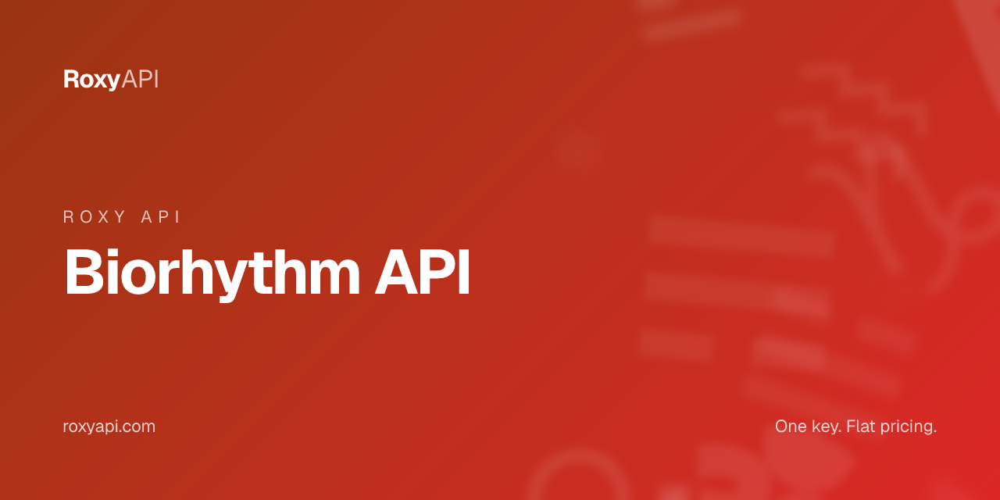

# Biorhythm API

> 10 cycle types, critical day alerts, compatibility, and multi-day forecasts. One key covers 10 spiritual domains. MCP-first, no local setup required.

[](https://roxyapi.com/pricing)
[](https://roxyapi.com/api-reference)
[](https://roxyapi.com/methodology)
[](https://roxyapi.com/docs/mcp)
[](https://roxyapi.com/docs/sdk)

## What is Biorhythm API

The RoxyAPI biorhythm endpoint ships 10 cycle types (physical, emotional, intellectual, intuitive, aesthetic, awareness, spiritual, passion, mastery, wisdom) where most implementations stop at three. One RoxyAPI subscription covers 10 spiritual domains: biorhythm, Western astrology, Vedic astrology, numerology, tarot, I Ching, crystals, dreams, and angel numbers. This repo ships working TypeScript, JavaScript, and Python samples so you can drop biorhythm features into a wellness, productivity, or coaching product in minutes. The broader catalog positions include Roxy Ephemeris, verified against NASA JPL Horizons, for all positional calculations across the same subscription.

## Why this API

| Property | Value |
|----------|-------|
| Coverage | 10 spiritual domains in one subscription |
| Calculation | Roxy Ephemeris, verified against NASA JPL Horizons |
| MCP server | `https://roxyapi.com/mcp/biorhythm` (Streamable HTTP, no local setup) |
| SDKs | TypeScript on npm `@roxyapi/sdk`, Python on PyPI `roxy-sdk` |
| Pricing | One key, flat per call, $39 for 25K calls |
| Licensing | No AGPL or GPL entanglement |
| Last verified | 2026-Q2 |

## Quick start

1. Get a key at [roxyapi.com/pricing](https://roxyapi.com/pricing)
2. Pick a language below
3. Copy the snippet, run, ship

### cURL

```bash
curl -X POST https://roxyapi.com/api/v2/biorhythm/daily \
  -H "X-API-Key: $ROXY_API_KEY" \
  -H "Content-Type: application/json" \
  -d '{"seed":"sample-user","date":"2026-04-23"}'
```

### Python

```python
import os
from roxy_sdk import create_roxy

roxy = create_roxy(os.environ["ROXY_API_KEY"])

# Daily biorhythm: seeded reading with energy rating and cycle snapshot across 10 cycle types
bio = roxy.biorhythm.get_daily_biorhythm(seed="sample-user", date="2026-04-23")

print(bio["energyRating"])                       # 5
print(bio["overallPhase"])                       # critical
print(bio["quickRead"]["physical"])              # -73
print(bio["quickRead"]["emotional"])             # 0
print(bio["quickRead"]["intellectual"])          # 62
print(bio["spotlight"]["cycle"])                 # physical
print(bio["spotlight"]["value"])                 # -73
```

### JavaScript (Node)

```js
import { createRoxy } from '@roxyapi/sdk';

const roxy = createRoxy(process.env.ROXY_API_KEY);

// Daily biorhythm reading: energy rating, phase, and three primary cycle values
const { data, error } = await roxy.biorhythm.getDailyBiorhythm({
  body: { seed: 'sample-user', date: '2026-04-23' },
});

if (error) throw new Error(error.error);

console.log('Energy rating:', data.energyRating);            // 5
console.log('Overall phase:', data.overallPhase);            // critical
console.log('Physical cycle:', data.quickRead.physical);     // -73
console.log('Spotlight cycle:', data.spotlight.cycle);       // physical
console.log('Daily advice:', data.advice);
```

### TypeScript

```ts
import { createRoxy } from '@roxyapi/sdk';

const roxy = createRoxy(process.env.ROXY_API_KEY!);

// Daily biorhythm: seeded reading returns energy rating, phase, spotlight, and quickRead cycles
const { data, error } = await roxy.biorhythm.getDailyBiorhythm({
  body: { seed: 'sample-user', date: '2026-04-23' },
});

if (error) throw new Error(error.error);

console.log('Energy rating:', data.energyRating);            // 5
console.log('Overall phase:', data.overallPhase);            // critical
console.log('Physical:', data.quickRead.physical);           // -73
console.log('Emotional:', data.quickRead.emotional);         // 0
console.log('Intellectual:', data.quickRead.intellectual);   // 62
console.log('Spotlight:', data.spotlight.cycle, data.spotlight.value);
```

## Request schema

| Field | Type | Required | Description |
|-------|------|----------|-------------|
| `seed` | string | no | Reproducibility key. Same seed plus same date always returns the same reading. Pass any stable identifier such as a user ID or email hash. Omit for anonymous daily readings. |
| `date` | string | no | Date for the reading in YYYY-MM-DD format. Defaults to today (UTC). Useful for historical lookups or pre-generating future readings. |

## Response shape

```json
{
  "date": "2026-04-23",
  "seed": "sample-user-2026-04-23",
  "energyRating": 5,
  "overallPhase": "critical",
  "spotlight": {
    "cycle": "physical",
    "value": -73,
    "phase": "low",
    "message": "Your physical energy is significantly diminished..."
  },
  "quickRead": {
    "physical": -73,
    "emotional": 0,
    "intellectual": 62
  },
  "dailyMessage": "Your biorhythm for 2026-04-23: Energy rating 5/10 (Balanced). Physical cycle is low energy at -73%.",
  "advice": "Prioritize rest and recovery. Save demanding tasks for a higher energy phase."
}
```

| Field | Type | Description |
|-------|------|-------------|
| `date` | string | Date the reading is computed for (YYYY-MM-DD, UTC) |
| `seed` | string | Computed seed used for this reading. Same value always produces the same output. |
| `energyRating` | number | Overall energy score from 1 to 10 |
| `overallPhase` | string | Summary phase: `high_energy`, `mixed`, `recovery`, or `critical` |
| `spotlight` | object | Featured cycle for this seed: `cycle` name, `value` (-100 to 100), `phase`, and `message` |
| `quickRead.physical` | number | Physical cycle value (-100 to 100) |
| `quickRead.emotional` | number | Emotional cycle value (-100 to 100) |
| `quickRead.intellectual` | number | Intellectual cycle value (-100 to 100) |
| `dailyMessage` | string | Concise daily message combining energy rating and spotlight cycle |
| `advice` | string | Actionable 1-2 sentence guidance for the day |

## Common use cases

| Use case | Endpoint flow |
|----------|---------------|
| Daily wellness check-in for a mobile app | POST `/biorhythm/daily` with the user ID as seed and today as date |
| Pre-generate tomorrow notification copy | POST `/biorhythm/daily` with tomorrow as date; cache and send at 07:00 local time |
| Best-day planner for a coaching product | POST `/biorhythm/forecast` with `birthDate`, `startDate`, `endDate`; surface `summary.bestDay` |
| Critical day alerts for a sports or medical app | POST `/biorhythm/critical-days` with `birthDate`; filter `criticalDays[].severity` |
| Couples biorhythm compatibility | POST `/biorhythm/compatibility` with two `birthDate` values; read `overallScore` and `rating` |

## Related endpoints in this domain

- `POST /biorhythm/forecast` (`getForecast`) - multi-day best-day and worst-day planner with full 10-cycle data per day
- `POST /biorhythm/critical-days` (`getCriticalDays`) - zero-crossing alert days for sports, medical, and productivity caution features
- `POST /biorhythm/compatibility` (`calculateBioCompatibility`) - couples and team dynamics compatibility score across all cycle types

## Use this in your AI agent

Connect Claude, GPT, Gemini, or Cursor to RoxyAPI through the remote MCP server. No Docker. No self hosting. The full MCP tool catalog for this domain is at `https://roxyapi.com/mcp/biorhythm`.

```json
{
  "mcpServers": {
    "biorhythm": {
      "url": "https://roxyapi.com/mcp/biorhythm",
      "headers": { "X-API-Key": "$ROXY_API_KEY" }
    }
  }
}
```

See [docs/mcp](https://roxyapi.com/docs/mcp) for Claude Desktop, Cursor, Windsurf, VS Code, and Claude Code setup.

## For AI coding agents

This repo ships an [AGENTS.md](AGENTS.md) execution playbook. Cursor, Claude Code, Aider, Codex, Windsurf, RooCode, and Gemini CLI will pick it up automatically. Top level overview lives at [roxyapi.com/AGENTS.md](https://roxyapi.com/AGENTS.md).

## Resources

- [Methodology and gold standard tests](https://roxyapi.com/methodology) verified against NASA JPL Horizons
- [Full API reference](https://roxyapi.com/api-reference) interactive Scalar UI
- [TypeScript SDK on npm](https://www.npmjs.com/package/@roxyapi/sdk)
- [Python SDK on PyPI](https://pypi.org/project/roxy-sdk/)
- [llms.txt](https://roxyapi.com/llms.txt) full LLM citation index
- [Top level AGENTS.md](https://roxyapi.com/AGENTS.md)

## Other RoxyAPI samples

[](https://github.com/RoxyAPI/kp-astrology-api)
[](https://github.com/RoxyAPI/kundli-api)
[](https://github.com/RoxyAPI/synastry-api)
[](https://github.com/RoxyAPI/natal-chart-api)
[](https://github.com/RoxyAPI/numerology-api)

## License

MIT. See [LICENSE](LICENSE).

## Contact

- Site: [roxyapi.com](https://roxyapi.com)
- Status: [roxyapi.com/api-reference](https://roxyapi.com/api-reference)
